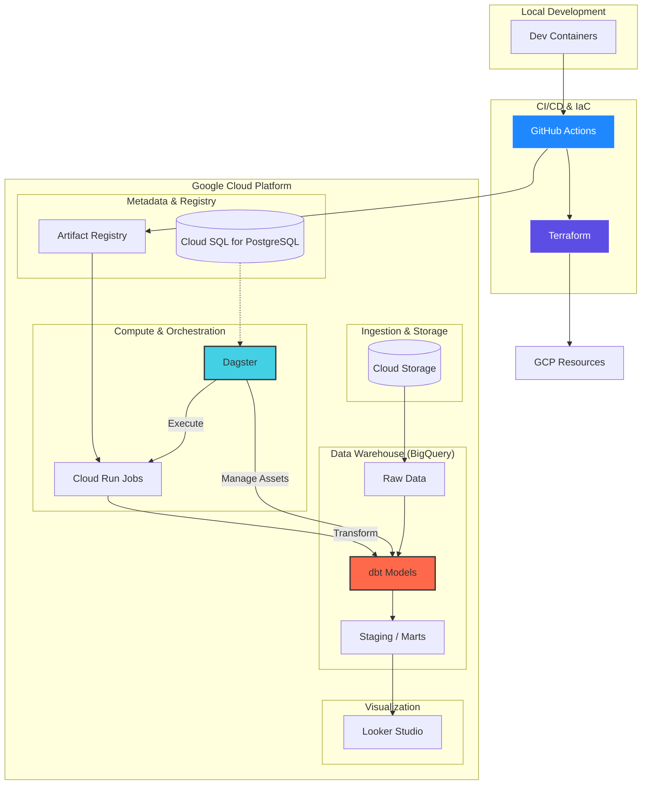
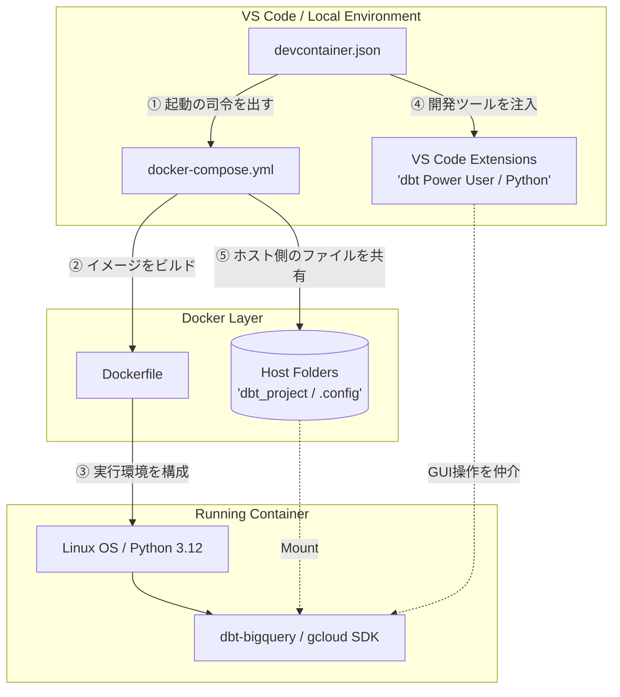

# フェリー会社のデータ基盤構築演習（SHIPS_PJ）

## 概要

データエンジニアリング力の向上を目的として、実践演習を通してデータ基盤を構築する。

### テーマ

中距離旅客船会社の予約管理システムと分析基盤
※中距離フェリー: 旅客フェリーの内、片道の航路距離が100km以上、300km未満の航路に就航するフェリーのこと。
※基盤の役割: 基幹DBからデータを抽出し、**『予約行動』『顧客属性』『便別稼働』** を多角的に分析が可能。

### 使用技術

|技術要素|サービス名|選定理由|備考|
|--|--|--|--|
|ETL|dbt|SQLのみで実装が可能。データリネージによる利用項目の追跡性が魅力。|Generic Tests, Unit Tests, docs, マクロ, Jinja, Incremental Models, dbt-expectations|
|オーケストレーションツール|dagstar|airflow, prefectと違いタスク指向ではなく、データ中心である。dbtとの相性|-|
|IaC|Terraform|複数のプロバイダーに対応。デファクトスタンダードである。|-|
|CI/CD|GitHub Actions|特定のクラウドに依存することなく実装が可能である。|-|
|プラットフォーム|Google Cloud|コストパフォーマンスが最適である。|Cloud Run job、BigQuery、Cloud Storage、Artifact Repository、Cloud SQL for PostgreSQL|
|BI|Looker Studio|Google Cloudとの親和性|-|
|開発環境|Dev Containers|開発用と本番用のコンテナの環境差異を減らすことが可能である。|-|

### データ基盤の構成

基幹システム(Cloud SQL for PostgreSQL)からデータを抽出し、BigQueryへ挿入する。
BigQuery内で分析用マートの作成を行う。



### ユースケース

#### ターゲット

- 運行管理者: 船ごとの乗船率（稼働率）を確認し、ダイヤ改正や機材繰りの検討。
- マーケティング担当者: キャンペーンの費用対効果や、新規・リピーターの動向の把握。

#### ビジネス要件

- 予約・乗船分析（売上の源泉）
  - ビジネス要件: どのルートが、いつ、誰に売れているかを把握し、空席を減らしたい。
  - ターゲット: 運行管理者
  - 主要KPI:
    - **乗船率（Load Factor）**: 定員に対する実績人数の割合。
    - **予約リードタイム**: 出港何日前に予約が入るか。
    - **ARPU（客単価）**: 1人あたりの平均支払い額。
  - 分析テーマ（例）
    - 予約行動分析: 「予約が直前に集中しているから、早割の割引率を上げて予約を前倒しさせよう」

- キャンペーン効果・顧客分析（集客の効率化）
  - ビジネス要件: 「シニア割引」や「学生向けキャンペーン」を打つべき時期や、リピート層の特性を特定したい。
  - ターゲット: マーケティング担当者
  - 主要KPI:
    - **リピート率:** 全乗船者のうち、2回以上利用した人の割合。
    - **顧客属性別シェア**: 性別・年代・居住地別の構成比。
    - **会員/非会員比率**: ポイント制度が効いているかの確認。
  - 分析テーマ（例）
    - 顧客セグメント分析: 「夏休みに乗船した新規客が、秋にリピートしていない。秋の割引クーポンを新規客に送ろう」

- 運航効率の最適化
  - ビジネス要件: 便ごとの需要のムラを特定し、将来的な増便や減便の判断材料にしたい。
  - ターゲット: 運行管理者
  - 主要KPI:
    - **便別・曜日別乗船率**: 週末と平日の差、特定の時間帯（昼便・夜便）の需要差。
  - 分析テーマ（例）
    - 需要予測・稼働分析: 火曜日の1便目は常に乗船率20%以下だ。この便だけ小型船に切り替えるか、減便を検討しよう」

---

## データの詳細

### 船（基本情報）

- 船：4隻（AppleMaru, BananaMaru, OrangeMaru, GrapeMaru）

|船名|全長|全幅|総トン数|航海速力|旅客定員|
|--|--|--|--|--|--|
|Apple, Banana|199.6m|27.1m|14500トン|23ノット|502名|
|Orange, Grape|95.1m|22.1m|15301トン|20ノット|665名|

### 客室

- 基本情報

|クラスID|クラス|特徴|
|--|--|--|
|SY|スイート(洋室)|二名個室。「室単位」で予約。|
|SW|スイート(和室)|四名個室。「室単位」で予約。|
|DX|デラックスシングル|一人用個室。「室単位」で予約。|
|TR|ツーリング（寝台）|一人用個室。「室単位」で予約。|
|EC|エコノミー（雑魚寝）|大部屋。「エリアの定員」で管理。部屋番号が固定されない。|
|FC|一等室|二名個室。「室単位」で予約。|
|SC|二等室|八名部屋。「エリアの定員」で管理。部屋番号が固定されない。|
|TC|三等室|大部屋。「エリアの定員」で管理。部屋番号が固定されない。|

- AppleMaru, BananaMaru

|クラスID|クラス名|定員/室|客室数|総人数|
|--|--|--|--|--|
|SY|スイート(洋室)|2名|20室|40名|
|SW|スイート(和室)|4名|5室|20名|
|DX|デラックスシングル|1名|40室|40名|
|TR|ツーリング（寝台）|1名|50室|50名|
|EC|エコノミー（雑魚寝）|16名|22室|352名|
|計||||502名|

- OrangeMaru, GrapeMaru

|クラスID|クラス名|定員/室|客室数|総人数|
|--|--|--|--|--|
|FC|一等室|2名|6室|12名|
|SC|二等室|8名|6室|48名|
|TC|三等室|40名|12室|480名|
|計||||540名|

### 航路

- 航路(routes)
  - ABC港 ↔ XYZ港: R1
  - ABC港 ↔ PQL港: R2

### ダイヤ

- ダイヤ：
  - 前提
    - ABC港 ↔ XYZ港: 約3時間15分
    - ABC港 ↔ PQL港: 約1時間40分
    - 経由地 停泊時間: 約2時間
  - サイクル時間：
    - R1 (Apple / Banana): 片道3時間15分 + 停泊2時間 ＝ 1サイクル 5時間15分
    - R2 (Orange / Grape): 片道1時間40分 + 停泊40分 ＝ 1サイクル 2時間20分

- タイムテーブル（24時間運用・標準案）
  - 【R1航路】ABC港 ↔ XYZ港
    - AppleMaruとBananaMaru
    - 8便（4往復）
  - 【R2航路】ABC港 ↔ PQL港
    - OrangeMaruとGrapeMaru
    - 1日16便（8往復）

- 【R1航路】ABC港 ↔ XYZ港

|運用順|船名|ABC発|XYZ着|⇔|XYZ発|ABC着|
|--|--|--|--|--|--|--|  
|1便|Apple|08:00|11:15||13:15|16:30|
|2便|Banana|13:15|16:30||08:00|11:15|
|3便|Apple|18:30|21:45||23:45|03:00|
|4便|Banana|23:45|03:00||18:30|21:45|

- 【R2航路】ABC港 ↔ PQL港

|運用順|船名|ABC発|PQL着|⇔|PQL発|ABC着|
|--|--|--|--|--|--|--|  
|1便|Orange|07:00|08:40||09:20|11:00|
|2便|Grape|09:20|11:00||07:00|08:40|
|3便|Orange|11:40|13:20||14:00|15:40|
|4便|Grape|14:00|15:40||11:40|13:20|
|5便|Orange|16:20|18:00||18:40|20:20|
|6便|Grape|18:40|20:20||16:20|18:00|
|7便|Orange|21:00|22:40||23:20|01:00|
|8便|Grape|23:20|01:00||21:00|22:40|

---

## テーブル一覧

### Staging層(stg_)

- 基幹DBからBigQueryにロードされたデータを、後の工程で使いやすく整えるレイヤー
- 主な処理: 重複削除（もしあれば）、データ型の最適化（CHARをSTRINGに、タイムスタンプのタイムゾーン調整）、カラム名の標準化。
- テーブル構成:
  - マスタ系テーブル（船・客室関連）
    - stg_ships (船マスタ（基本情報）テーブル)
    - stg_room_class_master (客室クラス定義マスタテーブル)
    - stg_ship_room_classes (船別客室設定テーブル)
  - マスタ系テーブル（航路・港関連）
    - stg_ports (港テーブル)
    - stg_routes（航路テーブル）
    - stg_sections（区間テーブル）
    - stg_schedules (運航ダイヤテーブル)
  - トランザクション系テーブル（予約・在庫）
    - stg_reservations（予約基本情報テーブル）
    - stg_reservation_details (予約明細情報テーブル)
    - stg_inventory (在庫テーブル)

### Intermediate層(int_)

- 複数のマスタを結合したり、複雑な計算ロジックを共通部品として定義するレイヤー
- int_vessel_schedules: 
  - stg_schedules に ships, sections, routes, ports を結合。
  - 目的: 「いつ、どの船が、どこからどこへ行くか」という情報を1つのワイドなテーブルにし、後の集計を楽にする。
- int_reservation_combined: 
  - stg_reservations と stg_reservation_details を結合。
  - 目的: 予約者情報と明細（乗客ごと）を紐付け。ここで reservation_date と departure_date の差分を計算し、**「予約リードタイム」**を算出する。
- int_daily_inventory_metrics: 
  - stg_inventory をベースに、在庫消化率などを計算。

### Mart層(fct_/dim_)

- ビジネス要件に基づき、BIツールや分析者が直接クエリを投げる最終成果物のレイヤー
- 【予約・乗船分析】向け
  - fct_ticket_sales (チケット販売ファクト)
  - 粒度: 予約明細（1チケット）ごと
  - カラム: 予約ID, スケジュールID, 船ID, 航路名, 客室クラス名, 適用料金, 予約リードタイム(予約日、乗船日), 乗客区分(大人/子供), 曜日フラグ
  - 用途: 売上集計、予約の早まり・遅まり分析。
- 【キャンペーン効果・顧客分析】向け
  - dim_passengers (顧客ディメンション)
  - 粒度: 乗客（Passenger）ごと
  - カラム: 乗客ID, 性別, 居住地, 累計乗船回数, 初回乗船日, 直近乗船日, よく利用する航路, 年代(10歳刻み), 平均LTV
  - 用途: リピーター分析、ターゲット層の特定。
- 【運航効率の最適化】向け
  - fct_voyage_performance (航海実績ファクト)
  - 粒度: スケジュール（便）ごと
  - カラム: スケジュールID, 船名, 航路, 便, 出港日, 曜日, 祝日フラグ, 定員, 確定予約人数, 乗船率(%), 在庫消化速度
  - 用途: 便ごとの人気度比較、減便・増便の経営判断。

---

## 環境構成

### フォルダ構成

```bash
~/ship-pj/
├── .devcontainer/      # 開発環境（VS Code設定）
├── .github/             # GitHub Actions
│   └── workflows/
│       ├── ci.yml       # テスト自動化（dbt test, dagster check）
│       └── cd.yml       # デプロイ自動化（Docker build & push, Terraform apply）
├── terraform/           # インフラ管理（Google Cloudのリソース定義）
│   ├── main.tf
│   ├── variables.tf
│   └── bigquery.tf      # データ基盤の定義
├── dbt_project/         # dbt（データ変換ロジック）
├── dagster_project/     # Dagster（オーケストレーション）
├── Dockerfile           # 本番用イメージ（Dagster + dbt）
├── docker-compose.yml   # ローカル実行用
└── requirements.txt
```

### コンテナ関連の関係性


